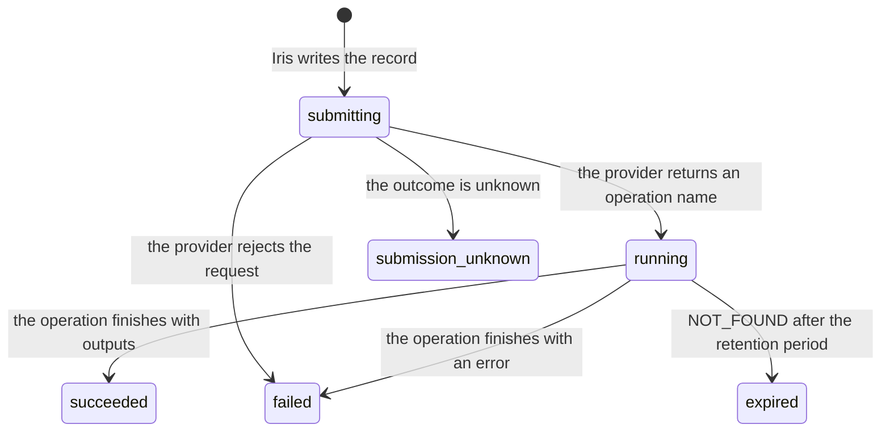

# How video jobs work

Veo generates videos asynchronously. The provider accepts a request, returns an operation name, and
finishes the video later. Iris tracks each video as a job, with a record on your disk, so that any
later Iris process can follow the job and download the video.

This page explains where job records live, what they contain, how a job moves through its states,
and how downloads, retention, and deletion work. For step-by-step instructions, see
[Generate videos](../guides/videos.md).

## Why only videos create jobs

Image requests are synchronous. The provider returns the image in the same HTTP response and
doesn't return an ID that Iris could use to look up the request later. There's nothing to record
between the request and the response, so `iris image` commands don't create jobs.

Veo's `predictLongRunning` method returns an operation name that Iris can check from any process
until the provider's retention period ends. That's what makes a durable job possible.

## Where job records live

Iris keeps job records in the jobs directory inside its state directory. To see the paths on your
machine, run `iris config path`. The output is similar to the following:

```text
config file: /home/you/.config/iris/config.toml
state dir:   /home/you/.local/state/iris
jobs dir:    /home/you/.local/state/iris/jobs
```

For the default location and how to change it, see [Paths](../reference/configuration.md#paths).

Only a process that uses the same state directory can follow a job. On another machine, in a fresh
container, or with a different `HOME` or `IRIS_STATE_DIR`, Iris reports `job_not_found`, even though
the provider still has the job. If you run Iris in containers or CI, keep the state directory on a
persistent volume, or set `IRIS_STATE_DIR` to the same path for every command.

Each job is one file, `JOB_ID.json`, in the jobs directory. Iris creates directories with mode
`0700` and records with mode `0600`. It also creates empty lock files when it needs them:
`JOB_ID.lock` and `JOB_ID.download.lock` for each job, and `labels.lock` for the jobs directory.
Lock files stay on disk after use. `iris jobs delete` removes a job's lock files with its record.

Iris doesn't delete job records on its own, whatever their age. A record stays until you delete it
with `iris jobs delete`.

## What a job record contains

A job record holds what Iris needs to follow, diagnose, and download the job, and little else:

- The job ID, your label if you gave one, the provider, the model, how the model was chosen
  (`model_source`), the status, and timestamps.
- The remote operation name, and the earliest time that the provider may delete the outputs
  (`remote_expires_at`).
- The resolved request options, such as `duration` and `resolution`, and how many input images of
  each role the request had. Iris doesn't store input file paths or their content.
- The prompt's SHA-256 hash and length. Iris stores the prompt text only if you set
  `jobs.store_prompts` to `true`, and job views never show the text.
- Where to save the outputs and, for each output, its remote URI, media type, download state, local
  path, size, and hash.

For example, the following record is for a job whose video was downloaded. Hashes and the cost
estimate are shortened:

```json
{
  "schema_version": 1,
  "job_id": "job_01m3asyx4dya3grvdg4b28g2ms", "label": null,
  "provider": "gemini", "model": "veo-3.1-fast-generate-preview", "model_source": "flag",
  "operation": "video.generate", "status": "succeeded",
  "created_at": "2026-09-24T22:53:12Z", "submitted_at": "2026-09-24T22:53:12Z",
  "updated_at": "2026-09-24T22:53:12Z", "completed_at": "2026-09-24T22:53:12Z",
  "last_checked_at": "2026-09-24T22:53:12Z",
  "remote_operation_id": "models/veo-3.1-fast-generate-preview/operations/op_mockjob001",
  "provider_request_id": null,
  "remote_expires_at": "2026-09-26T22:53:12Z", "submit_budget_seconds": 2145,
  "request": { "aspect_ratio": "16:9", "count": 1, "duration": 4, "resolution": "720p",
               "input_counts": { "first_frame": 0, "last_frame": 0, "reference": 0 } },
  "prompt": { "sha256": "c039da7d...", "chars": 31, "text": null },
  "output_plan": { "dir": "/home/you", "path": null, "overwrite": false },
  "outputs": [ { "index": 0,
                 "remote_uri": "https://generativelanguage.googleapis.com/v1beta/files/<id>:download?alt=media",
                 "media_type": "video/mp4", "download_state": "downloaded",
                 "local_path": "/home/you/job_01m3asyx4dya3grvdg4b28g2ms.mp4", "bytes": 764,
                 "sha256": "56222df0...", "width": null, "height": null, "duration_seconds": 4.0,
                 "downloaded_at": "2026-09-24T22:53:12Z", "last_error": null } ],
  "error": null, "usage": null,
  "cost_estimate": { "estimated": true, "currency": "USD", "amount": 0.4, "...": "..." }
}
```

Iris writes each file with sorted keys; this example groups related keys instead.

Records are versioned, and every version of Iris can read the records of earlier versions:

- Each record has a `schema_version`, which is 1 in Iris 0.1.0. Iris refuses to read a record
  with a newer `schema_version` (`state_invalid`) instead of misreading it.
- When Iris rewrites a record, it keeps every field that it doesn't know, at every level, so an
  older Iris never deletes a newer one's data. For how Iris shows an error code that it doesn't
  know, see [Codes from newer versions](../reference/errors.md#codes-from-newer-versions).
- Iris writes a record to a temporary file in the same directory, flushes it to disk, and renames it
  over the old record. A reader never sees a partial record. `iris jobs list` reads records without
  locking them, so a stuck process can't block it.

## Job states

A job has one of these statuses:

| Status | Meaning |
|---|---|
| `submitting` | Iris wrote the record and is sending the request. |
| `running` | The provider accepted the job and is generating the video. |
| `succeeded` | The job finished. Its outputs are recorded and can be downloaded. |
| `failed` | The provider rejected the request, reported an error, or returned no usable output. |
| `expired` | The provider no longer has the operation, and the retention period has passed. |
| `submission_unknown` | Iris can't tell whether the provider accepted the request. |

A job changes status only in these ways:

| From | To | When |
|---|---|---|
| `submitting` | `running` | The provider responds with HTTP 2xx and an operation name. |
| `submitting` | `failed` | The provider rejects the request with an HTTP error, or the connection fails before the request is sent. |
| `submitting` | `submission_unknown` | The request times out or the connection drops after the request is sent, or the response can't be read or parsed. |
| `running` | `succeeded` | A status check finds the operation done, with outputs. |
| `running` | `failed` | A status check finds the operation done, with an error. |
| `running` | `expired` | A status check gets Google's `NOT_FOUND` error after the retention period. |

The following diagram shows the same transitions:



Each output of a succeeded job has its own download state. It starts as `pending` and becomes
`downloaded`, `failed`, or `expired`. A `failed` output can be downloaded again. A `downloaded`
output stays downloaded: if a later download of it fails, only its `last_error` changes.

Iris applies these rules to every job:

- **Nothing local fails a job.** Ctrl+C, a wait time limit, a network error while checking status,
  and a failed download don't change a job's status, because none of them affects the remote job.
- **A stopped submitter is detected.** A record that stays `submitting` longer than the whole
  submission time budget, plus 60 seconds, is reported as `submission_unknown`: the process that
  submitted it stopped during the request. With the default settings, that's about 37 minutes. The
  record keeps `submitting` on disk. Iris uses the larger of its own budget and the budget that the
  submitting process recorded, so a process with longer time limits isn't declared stopped early.
  To change the budget, see [Time limits](../reference/configuration.md#time-limits).
- **Unusable outputs are isolated.** When an operation finishes with output URIs, the job is
  `succeeded` and Iris records every URI. An output whose URI isn't an `http` or `https` URL, or
  that contains user information or a fragment, can never be downloaded. That output alone is
  `failed`, with `provider_bad_response` and an `output_item_unusable` warning. The job is `failed`
  only if the provider reports an error, returns no outputs, or returns only unusable URIs.
- **An ended job keeps its error.** A job that ended without success always shows its error with
  `retryable: false`, because repeating a command can't change it. See
  [Errors of ended jobs](../reference/errors.md#errors-of-ended-jobs).

## Submitting a job

When you run `iris video generate`, Iris does the following:

1. Runs every local check: the model, options, inputs, API key, and output directories. A request
   that fails a check leaves no job behind.
2. Writes the job record, with the status `submitting`.
3. Sends the paid request.
4. Records the operation name. The job is now `running`.

If the provider adapter refuses the request in step 3 before sending it, Iris exits with code 2 and
`provider_status: null`, and deletes the new record.

If you press Ctrl+C, or the process receives SIGTERM or SIGHUP:

- After step 2 but before Iris starts sending the request, Iris stops without sending anything,
  deletes the record, and exits with code 130 and `retryable: true`.
- During step 3, Iris finishes waiting for the provider's response, records the operation, and
  exits with code 130. The job is `running`. To resume it, run `iris jobs wait JOB_ID`.
- A second interrupt stops Iris immediately. The job stays `submitting` and is reported as
  `submission_unknown` once the submission budget has passed.

In the last two cases, the error has `retryable: false` and `details.charge_possible: true`. The
provider might have accepted and billed the request, so running `iris video generate` again could
pay for a second video.

If the process is killed with SIGKILL or crashes in step 3, it can't print the job ID. To find the
job, see [Recover a job after a crash](../guides/videos.md#recover-a-job-after-a-crash).

## Labels

A label is a name that you give a job with `iris video generate --label`. No two job records in a
state directory have the same label, whatever their status. This lets a script run the same command
again after a crash without paying twice: the second run fails with `label_in_use` before it sends
anything, and names the existing job.

Iris checks the label and writes the record as one step, under the lock file `labels.lock`. If two
commands with the same label start at the same time, the second waits for the first, finds its
record, and stops, so only one of them submits a job. While a job record can't be read, it might
have the label, so Iris refuses every labeled submission with `state_invalid` until you remove or
fix the record.

For how to use labels, see [Label a job](../guides/videos.md#label-a-job).

## Downloads

Downloading is separate from generating. `iris jobs download`, and the download step of
`iris jobs wait`, read the output URIs that the job recorded and fetch the files. They never submit
anything to the provider.

For each output, Iris does the following, while it holds the job's download lock:

1. If the output is already downloaded, and the recorded file still exists with the recorded size
   and hash, is valid media, and is at the requested path, Iris skips it with an
   `already_downloaded` warning. You can repeat a download any number of times.
2. If the recorded file is intact but you asked for a different path, Iris copies the file, without
   a network call. If the file changes or disappears during the copy, Iris fetches the output
   instead (step 3). Iris never reuses the recorded file when you pass `--overwrite`, which asks
   for a fresh copy, or when the file isn't valid media.
3. Iris checks that it may fetch the recorded URI with the current configuration. For Veo, the URI
   must be a Files API download URL under the configured Gemini base URL. See
   [Base URL overrides](../reference/configuration.md#base-url-overrides). If the URI isn't
   allowed, the output fails with `download_failed` and Iris requests nothing. The job stays
   `succeeded`, so you can download it again after you correct the base URL. Otherwise, Iris
   streams the file, computes its hash, and checks that it's complete, valid media of the declared
   type. The following table shows how Iris treats the response.
4. Iris writes the file to a temporary file in the target directory, then renames it to the final
   name. Without `--overwrite`, the rename never replaces an existing file. A partial file never
   has the final name.

| Response | Error | Retryable | Output state |
|---|---|---|---|
| HTTP 410 | `artifact_expired` | No | `expired` |
| HTTP 403 or 404 after `remote_expires_at` | `artifact_expired` | No | `expired` |
| HTTP 403 or 404 before `remote_expires_at` | `download_failed` | Yes | `failed` |
| HTTP 401 | `authentication_failed` | No | `failed` |
| HTTP 429, or a `Retry-After` delay longer than 60 seconds | `rate_limited` | Yes | `failed` |
| HTTP 2xx with an error document, or content that doesn't match its declared type or is incomplete | `invalid_media` | Yes | `failed` |
| A file larger than 4 GiB | `download_failed` | No | `failed` |
| Any other status, or a network failure | `download_failed` | Yes, unless the failure is permanent | `failed` |

A video counts as complete only if it contains its movie metadata (`moov`) and media data (`mdat`),
and its sample offsets point inside the file. A transfer that stopped early is never recorded as
downloaded, even if its size matched the `Content-Length` header.

If a download fails for an output that you saved earlier, the saved file stays as it was, and the
error's hint says whether that file is unchanged, missing, or edited since the download.

### Temporary files

The temporary file of a download is named `.NAME.iris-part-RANDOM`. The process that writes it holds
a lock on it. Before Iris downloads or copies to a target, it deletes that target's temporary files
that no running process holds, which a killed or crashed run left behind. It leaves alone any file
that another process is still writing. On a file system without file locks, Iris doesn't delete
temporary files, and you can delete them by hand.

Iris cleans up after Ctrl+C, SIGTERM, and SIGHUP. After SIGKILL, a crash, or a power loss, these
files can remain:

- In the output directory: `.NAME.iris-part-RANDOM` from an interrupted download, which the next
  download to the same target deletes, and an empty `.iris-preflight.iris-part-RANDOM` from the
  output directory check.
- In the jobs directory: `.JOB_ID.json.RANDOM.tmp` from an interrupted record write. The record
  itself is intact, and `iris jobs list` ignores these files.
- A record that stays `submitting`, if the process stopped during the paid request.

### Downloading a job that's still running

If a job's record still says `running`, `iris jobs download` checks the job's status once, which is
free. If the job has finished, Iris downloads it. If it's still running, the command exits with code
4 (`job_not_ready`) without waiting or submitting anything.

If the status check fails for a temporary reason, such as a network error, the command also exits
with code 4, with `details.status_checked: false` and a `status_refresh_failed` warning. If the
check fails for any other reason, such as a missing API key, the command reports that error.
`iris jobs status` is different: it always shows the last known status, with a
`status_refresh_failed` warning when the check fails.

## Retention and expiry

Veo keeps generated videos for 2 days. Iris records `remote_expires_at` as the submission time plus
2 days, which is the earliest time that the provider may delete the outputs. Iris counts from
submission because that's when generation starts. `completed_at` is when Iris first saw the job
finish, which can be much later. `iris jobs status` shows the time as `kept until: at least TIME`.

Iris doesn't refuse a download because of this estimate. Every download asks the provider, which
may keep outputs longer. The table in [Downloads](#downloads) shows how Iris treats the response.

The same rule protects running jobs. When a status check gets HTTP 404, the job becomes `expired`
only if the response is Google's `NOT_FOUND` error and the retention period has passed. Any other
404 leaves the job `running`, such as an HTML page from a proxy, or a `NOT_FOUND` during the
retention period from a key in another Google Cloud project. In that case, `iris jobs status` shows
the last known status with a `status_refresh_failed` warning. `iris jobs wait` stops with
`permission_denied` (exit code 3), keeps `provider_status: 404`, and suggests checking the key's
project and the base URL.

## Deleting job records

`iris jobs delete` removes local job records. It doesn't cancel remote jobs or delete files that you
downloaded, and its result says so with `"remote_effect": "none"`.

> [!NOTE]
> You can't cancel a video job after you submit it, because Veo operations have no cancel or delete
> method. Iris also doesn't delete generated videos from the provider, because Google doesn't
> document whether the Files API's delete method applies to them.

Without `--force`, Iris refuses to delete a record when that would lose track of paid work:

- The job is `submitting` or `running` on disk. This includes a record that Iris reports as
  `submission_unknown` but that still says `submitting` on disk, because a slow submitter might
  still record the operation.
- The job succeeded, but some of its outputs aren't downloaded, and the provider still keeps them.
  The provider keeps them until `remote_expires_at`, or indefinitely if it documents no retention
  period. Outputs that can never be downloaded don't count.

Deletion is all or nothing. Iris checks every job that you name, or every record with `--all`,
before it deletes anything. If Iris refuses any of them, it deletes none. Without `--force`,
`--all` skips records that it can't read, with a `job_record_unreadable` warning. With `--force`,
it deletes them too.

`iris jobs delete` doesn't remove the `.JOB_ID.json.RANDOM.tmp` files that an interrupted write can
leave in the jobs directory. You can delete them by hand. To remove all of Iris's local data, see
[Uninstall Iris](../guides/install.md#uninstall-iris).

## Related

- [Generate videos](../guides/videos.md): submit, follow, and download jobs.
- [How Iris handles paid requests](paid-requests.md): retries and uncertain submissions.
- [Errors reference](../reference/errors.md): exit codes and error details.
